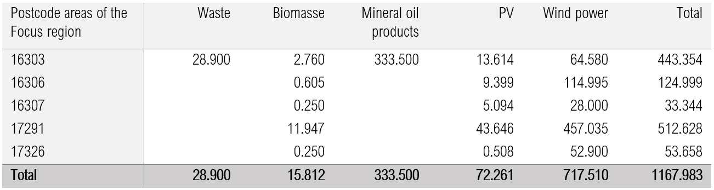

.. _data-sources:

Input data and sources
======================

**Electricity production**

The power plant list of the Federal Network Agency [#]_ gives an overview of the structure of power generation plants larger than 10 MWel. In total, 962 MW of electrical power is generated in the focus region, 62 % of which comes from renewable sources (mainly wind energy). The remaining 38 % are generated by the incineration of waste and refinery gas residues, which are limited to the industrial location of Schwedt.
The following table shows the generation capacities by energy source and postal code within the focus region.

Capacity of power generation plants in MW by energy source and postcode in the focus region [#]_

Timerows of generation and curtailment of the wind turbines
------------------------------------------------------------

In the following figure, the normalized real (blue) and synthetic (orange) generation load curves are plotted as areas over the year and the deviation signal (orange line). The visible orange area indicates the curtailed part of the wind power work that is available to the FlexOptions within the KWUM model. In total, this percentage is 14.33 % of the synthetic wind power work witch is adjusted from the curtailment.

Normalised real and synthetic wind feed-in from Bertikow transformer station and curtailment signal in 2016 as daily averages [#]_

It is difficult to make any assumptions about the future development of the scheme and they depend on a large number of factors which affect both the capacity utilisation of the transmission and distribution networks. In principle, grid expansion after the NEP contributes to a reduction in grid bottlenecks. Due to the peak capping and the time delay of the grid expansion, feed-in management can also be expected in the future. Since no detailed modelling of the electricity grid can be realised within the KWUM model, assumptions must be made here on the basis of other sources of information.
For this purpose, data from the eTraGo project, in which the German transmission and distribution grid was modelled and grid simulations for the future carried out on the basis of the NEP scenarios, are used [#]_ . With this model it is possible to simulate the future development of the feed-in and control behaviour in the individual substations between transmission grid and distribution grid.
The Flensburg University of Applied Sciences therefore requested a data set [#]_ for the feed-in and regulation of the Bertikow substation, of which real reference time series for feed-in and regulation already exist [#]_ .

Since no further plans for further grid expansion have been made so far and a continuation of the regulation is to be expected [#]_ , the same percentage of regulation of 10.77 % is assumed for the year 2050 which, in connection with the further increase in generation capacity, will result in an absolute increase in the regulation work.

.. image:: pictures/tab_wind_gen_curt.png

Generation and curtailed quantities of wind turbines in the focus region [#]_

Thermal plants in the district heat-ing systems
------------------------------------------------------------

For the future scenarios, it is assumed that FW consumption will be reduced by 2050 due to population decline and energy-efficient refurbishment. In order to avoid an unrealistic over-dimensioning of the plant park in the future, it is assumed that the plant capacities will be reduced in line with the expected FW consumption.

Development of the thermal capacities of the heat generation plants in Prenzlau [#]_

Development of the thermal capacities of the heat generation plants in Schwedt [#]_

Timerows of the district heat demand
------------------------------------------------------------

The "demandlib" from the oemof framework was used to generate the district heating load profile [#]_ . The theoretical calculation bases are based on the work of Hellwig 2003 [#]_ and the further development according to BGW 2006 [#]_ . The derivation of the input data relevant for load profile generation is described below.

- The annual space heating requirements of the household and GHD sectors are derived on the basis of Factor i3 2013. District heating consumption in Prenzlau is 25,400 MWh and for Schwedt 122,733 MWh [#]_ .
- Furthermore, the structure of the building with regard to type and age of the building is decisive for the construction of the heat load corridor. Older and small single-family houses tend to have a higher specific heat consumption than new multi-family houses. From the 2011 census data, both the age structure and the type of building can be derived as a function of the number of flats in buildings with FW connections per municipality [#]_ .
- The temperature measurement time series for 2016 was taken from the Climate Data Center of the German Weather Service [#]_ . The station Grünow was chosen as the temperature reference location due to its central location within the focus region. It is located about 5 km west of Prenzlau with the coordinates: 53.3153 N 13.9338 W.
- The building age classes are determined on the basis of the census data according to the BGW 2006 [#]_ method. The buildings in the FW-Netz Prenzlau are assigned to age group 6 and Schwedt to age group 5.

The methodical procedure as well as the sources used for the compilation of the FW load profiles are shown in the following figure.

Procedure for generating the FW consumption load profiles [#]_

Within the model, heat losses are taken into account indirectly by adding them evenly to consumption throughout the year [#]_ . In Prenzlau, 14.00 %  network losses are assumed [#]_ , in Schwedt 18.34 % [#]_ .
The maximum consumption in the respective heating network can be derived from the generated heat load profiles. This results in a peak load of 11.461 MWth in Prenzlau and 47.397 MWth in Schwedt, which is comparable to the real peak heat load of 52.000 MWth [#]_ in 2016. For the Prenzlauer FW network, however, there are no comparable values available.

.. [#] BNETZA 2018
.. [#]  Own representation according to 50 HERTZ 2018; BNETZA 2018
.. [#] Own representation according to ENERTRAG 2018
.. [#] MÜLLER u. a. 2018, S. 1
.. [#]   MÜLLER 2018
.. [#]   ENERTRAG 2018
.. [#]   KONDZIELLA u. a. 2019, S. 18
.. [#]   Own representation
.. [#]   Own representation
.. [#]   Own representation
.. [#]   OEMOF DEVELOPING GROUP 2018
.. [#]   HELLWIG 2003
.. [#]   BGW 2006
.. [#]   FAKTOR-I3 GMBH 2018
.. [#]   ZENSUS 2011 2011
.. [#]   DEUTSCHER WETTERDIENST 2018
.. [#]   BGW 2006, S. 42
.. [#] Own presentation; sources used: FAKTOR-I3 GMBH 2018; LOGA, STEIN, DIEFENBACH & BORN 2015; OEMOF DEVELOPING GROUP 2018; ZENSUS 2011 2011
.. [#]   KONSTANTIN 2018, S. 32
.. [#]   B.B.S.M. 2013, S. 31
.. [#]  STADTWERKE SCHWEDT GMBH 2018
.. [#]  STADTWERKE SCHWEDT GMBH 2017

