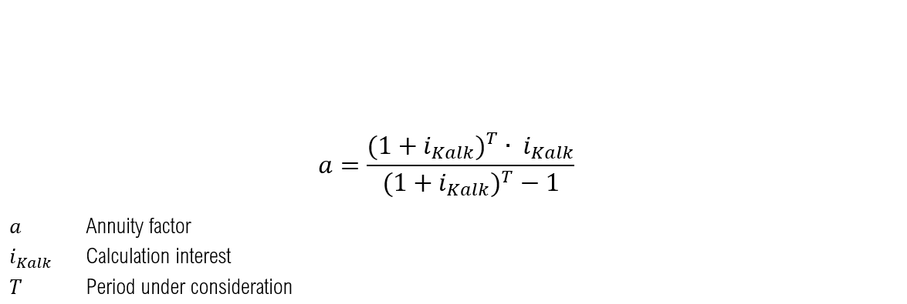

.. _economic_co2_ana:

Economic analysis and CO2-Emissions
======================================

Anlagenspezifische annuitätische Gesamtkostenbetrachtung
--------------------------------------------------------

The economic valuation of the individual plants is carried out by determining the annual costs and revenues. Usually, the annuity method (according to VDI 2067) [#]_ is used, in which financial variables such as interest rates, inflation and price changes are taken into account as a dynamic method. The total annual costs (capital costs, operating costs, electricity and gas costs incl. NNE, levies and charges) as well as the proceeds from electricity sales (for CHP plants and batteries) are distributed evenly over the 30 year period under consideration.
If a plant is not used within the scenarios, it is assumed that it will not be implemented in this case either, so that in this case all costs of the plant are omitted.
The annuity (AN_i) is calculated as follows:

**Capital-linked payments**

The assumed equity interest rate (i_EK) for district heating networks is 10 % and the assumed debt interest rate (i_FK) is 4 %. An equity share of 20 % results in a calculation interest rate (i_calc) of 5.2 % [#]_ and thus an interest factor (q) of 1.052. The inflation rate (j) is assumed to be 2.3 % after [#]_, resulting in a price change factor (r) of 1.023.
A period (T) of 30 years is considered, from which an annuity factor (a) of 0.06654 results in connection with the calculatory interest rate i_calc.

assumed parameters for capital expenditure under the annuity method

If the assets have to be replaced within the period under consideration (T) due to their lifetime, the present value of these replacements is calculated according to the following formula and is also taken into account within the capital-linked disbursements.

If the lifetime of the installation exceeds the period under consideration, the residual value of the installation is taken into account using the following formula.

**Demand-driven expenditure**

The demand-related expenditure AN_v includes the costs for electricity and gas procurement.

Different annual price changes are assumed for some cost components. These are shown in the following table and are taken into account in the economic analysis by multiplying the annual costs of the first year by the pricisdynamic present value factor and the annuity factor.

Assumptions of annual cost increases

**Operating expenditure**

In the case of operating expenditure, the technology-specific performance and work-related standard values are used instead of the investment-related factors for maintenance and repair (according to the VDI guideline).

**Revenues**

As in the case of electricity costs, no increase or decrease in future revenue from electricity sales is assumed.

Plant specific production and storage costs
-----------------------------------------------

Another important plant-specific valuation parameter is the output-related prime cost, which is used to calculate the specific costs per output unit generated. The total annuity AN_i calculated previously is compared with the generated annual output ∑_t▒〖P_(out_i ) (t) 〗 . This allows the heat production costs of PtH plants, the gas production costs of PtG plants and the storage costs of batteries to be mapped.

**District heating network-specific levelized costs of heat**

As the integration of further plants such as PtH displaces the heat generation of existing plants, this results in a low number of full-usage hours and thus higher plant-specific WGK of existing plants. In the next step, the economic effects of the use of flexibility options on the total heat production costs of the heating network will be investigated.
The heat production costs of the FW network 〖WGK〗_Netz are calculated by dividing the sum of the total annuity of the individual plants ∑_i▒〖AN_i 〗 by the sum of the amount of heat fed into the heat network ∑_i▒∑_t▒〖〖P_th〗_i (t) 〗. Since the batteries and PtG systems also have an indirect influence on the WGK of the FW networks through coupling with the heat generators, the total annuities of these systems are also taken into account in the calculation of the WGK.
The WGK of the grid refer to the heat share provided by gas-fired CHP, peak load heating plants and flexibility options. The renewable plants in the FW grid Prenzlau (component: CHP EE Prenzlau) as well as the external heat generation of the PCK refinery in Schwedt (component: CHP external Schwedt) are not substituted in the model and therefore have no influence on the use of the Flex options. Therefore, an economic analysis of these plants is not carried out.

CO2 emissions
-------------

The CO2 emission of the respective energetic outputs of the individual plants within the FW networks is calculated on the basis of the energy sources used in conjunction with their CO2 emission factors. Possible energy source inputs in the system under consideration are natural gas and electricity. While a constant CO2 emission factor is assumed for natural gas, the CO2 intensity of electricity differs with regard to the differentiation between grid electricity and FlexStrom mentioned above. For the purchase of grid electricity, CO2 emissions in the amount of the average assumed electricity mix in Germany are incurred depending on the respective year. The temporary and quantitative FlexStrom determined by the grid and market situation is assumed to be CO2 neutral.
If a battery is implemented in the scenario, the Flex options also have the option of obtaining electricity from the battery. The battery itself can draw both FlexStrom and net current and sell also current in the net to Day-ahead market prices, with which the possibility exists that FlexStrom can leave the system borders of the FW nets. Therefore the CO2 emission, which accumulates with the current storage, is calculated balance-fairly from the difference between the annual net purchase and net feed in by multiplying this with the CO2-Emissionsfaktor of the current mixes. As soon as more electricity is fed into the grid from the battery than is drawn from the grid, the CO2 emissions are therefore negative. This consideration is based on the assumption that in this case the battery makes CO2-neutral FlexStrom usable in the general electricity grid, which saves conventional power plant generation and thus reduces the CO2 emission factor of the grid electricity. If more electricity is drawn from the grid than is fed out, the total emissions of the battery are correspondingly positive.

The CO2 emissions of PtH and PtG result from the respective mains power supplies and those provided by the battery.

When calculating the CO2 emissions of a CHP unit, several methods can be applied [#]_ . In order to emphasize the advantages over uncoupled heat generation, the so-called efficiency method is applied according to the following formulas:

The CO2 emissions of the heating plant result from the natural gas supply of the network and the supply of synthetic natural gas from the PtG plants with the respective emission factors.

The total CO2 emissions of the respective FW network result from the sum of the absolute CO2 emissions of the individual plants. The CO2 emissions of the battery are indirectly contained in PtH and PtG via their battery power supplies.

.. [#]  VDI 2013
.. [#]    DUNKELBERG, GÄHRS, WEIß & SALECKI 2018, S. 79
.. [#]    DUNKELBERG u. a. 2018, S. 35

.. [#]  MAUCH, CORRADINI, WIESEMEYER & SCHWENTZEK 2010, S. 12