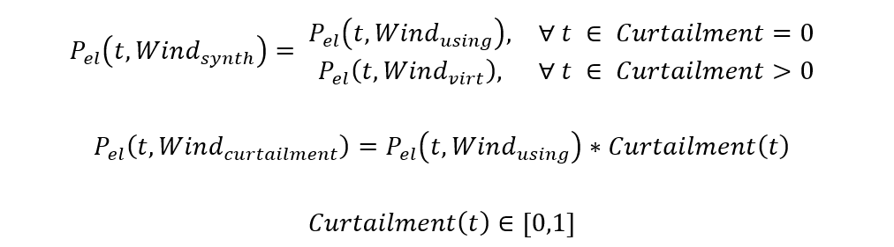
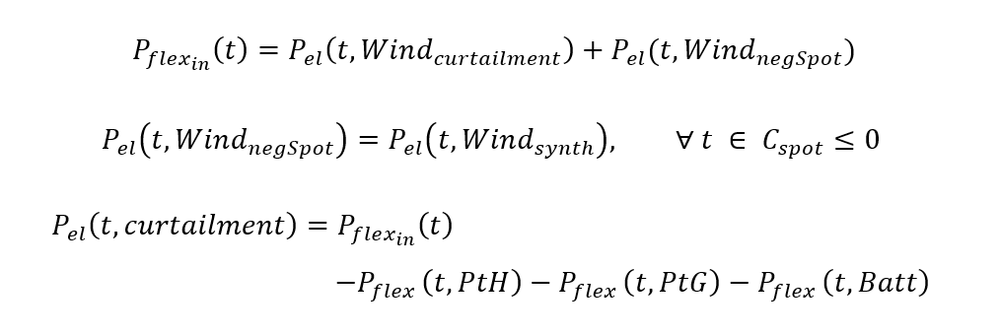

Model description
=================

**Basics of the Open Energy Model-ling Framework**

In order to optimize the application possibilities of FlexOptionen in the context of the considered focus region in the Uckermark regarding the operating costs, the KWUM model was further developed based on the work of Romero Garcia 2018 [#]_. This model was programmed on the basis of oemof [#]_ in Python.
Within oemof different generic components can be linked:

- The component "Source" acts as an energy source, which is used in the KWUM model to generate wind power and to provide electricity and gas from the grid.
- Energy conversions are modelled via the component "Transformer", with which CHP plants, heating plants, PtH and PtG are implemented.
- As soon as energy is consumed in the model or energy leaves the system, the "sink" component is used. These are used to model heat consumption, electricity sales and the regulation of the WTG.
- All components are connected via so-called "buses", which serve as collection points and enable energy balancing.

All components, with the exception of the buses, can be equipped with capacity restrictions, time series and variable costs, whereby an energy system is finally created in oemof. Using the modelling framework "Pyomo", the energy system thus created is formulated into a mixed integer problem, which is then solved by an external solver [#]_ and leads to the generation of optimised feed-in time series and energy flows.

**Model stucture of the operational cost optimization**

In order to cover the district heating demand, those systems are used which can generate the heat most cheaply at the respective time. This optimisation takes into account all labour-related costs and revenues of the individual plants. The investment costs of the plants, the power and capacity related electricity and gas procurement costs as well as fixed costs are not taken into account. These are recorded within the overall view (LINK!!!).
A total of three power sources are available to the FlexOptions, which are associated with different procurement costs depending on the scenarios. This means that electricity can be obtained from the grid at any time at day-ahead market prices and scenario-dependent levies and allocations (grid electricity). On the other hand, so-called FlexStrom is available at certain times, which is defined on the basis of the criteria for grid and market serviceability of the SINTEG-VO [#]_. FlexStrom is therefore electricity which would either have to be regulated out of the local wind turbines by one-man operations or which is available in the electricity grid at times of negative day-ahead market prices. In order to analyse potential synergies of PtH and PtG in connection with battery storage, these systems were additionally enabled to be supplied directly from the battery.
The basic structure of the energy system under consideration and the integration of the Flex options are shown in the following figure. Modeling details can be found in ???.

.. image:: pictures/kwum_model.png
    :alt: Schematic model representation

Schematic model representation

**Objective function**

In the KWUM model, optimisation is achieved by minimising the annual operating costs of the individual components of the energy system. The target function to be minimized is therefore:

**Further modeling equiations**

*Wind power generation and curtailment*

The synthetic time series of the wind generation used in the model corresponds to the original generation measurement data P_el (t,Wind_using ) outside the feed-in management inserts (Curtailment=0) and to the virtual generation load curve P_el (t,Wind_virt ) within the control (Curtailment>0).

FlexStrom is defined in the model as wind power, which is either regulated by feed-in management applications or which is generated at times of negative day-ahead market prices. This FlexStrom can be used either by the FlexOptionen for storage or energy conversion or is otherwise curtailed (P_el (t, curtailment)).

The costs of the FlexStrombezugs correspond to the Day-ahead market price, if this is negative at the time. Otherwise no costs result, since it concerns river, which would have to be abzuregeln in the reality.

*District heating demand*

A central secondary condition states that the heat demand of the FW networks P_th_demand must be covered by the available heat generation plants in each time step.

.. image:: pictures/formulas_heat_demand.png

*heating plants*

The operating costs of the heating plant consist of the procurement costs from the natural gas network C_(cs_gas ) and the variable operating costs C_(O&M_var ).

.. image:: pictures/formulas_heat_hp.png

The heat generation of the heating plant P_(〖th〗_out ) depends on the fuel input P_(〖Br〗_in ) and the efficiency η_th.

The fuel input is made up of the two possible gas sources. This is the natural gas supply from the P_(cs_gas ) gas network on the one hand and the synthetic natural gas supply from the PtG plant on the other.

In addition to the pure natural gas costs K_gas, the purchase of gas from the grid is subject to CO2 charges K_CO2, energy taxes K_(E-Tax), concession charges K_Konzess and the working price of NNE K_(NNE_AP ). There are no costs for the purchase of synthetic natural gas. These are taken into account within the PtG plant.

*CHP-Plant*

The operating costs for CHP plants result from the following formula:

CHP plants generate revenue from the sale of electricity at 〖(R〗_base), which is derived from the quarterly average baseload price of the EEX. This roughly corresponds to the market price for base-load electricity and is therefore more suitable as an input parameter for CHP plants than the more volatile day-ahead market price. In the model, the baseload price from the reference year 2016 is taken into account. On the other hand, operators of CHP plants receive a performance-related bonus (R_bonus) according to their electrical work fed into the grid.

In contrast to heating plants, CHP plants do not incur any CO2 costs or energy taxes.

.. image:: pictures/formulas_chp_3.png

*PtH plants*

The operating costs of the PtH plants result from the following formulas:

*PtG plants*

The operating costs of the PtG plants result from the following formulas:

The payment obligation for NNE and the electricity tax does not apply to PtG.

*Battery*

The operating costs of the battery systems result from the following formulas:

In the model, batteries have the option of generating revenue by feeding electricity back into the grid.

*Heat storage*

The operating costs of the heat accumulator result from the following formulas:

*Other heat generators*

Those heat generators which are not substituted by flexibility options are considered separately. These include heat generation from biogas and sewage gas in Prenzlau and heat extraction from the PCK refinery and the waste incineration plant in Schwedt. Their relative heat input into the FW grid P_th (other) was determined as a time series using the reference scenario without FlexOptions and is assumed to be fixed for all other scenarios.

.. [#]  ROMERO GARCÍA 2018
.. [#]  HILPERT u. a. 2018
.. [#]  The CBC Solver is Used in the KWUM Model
.. [#] ALBERT, DODERER, MATTHES, SCHÄFER-STRADOWSKY & STEFFENSEN 2018, S. 51
