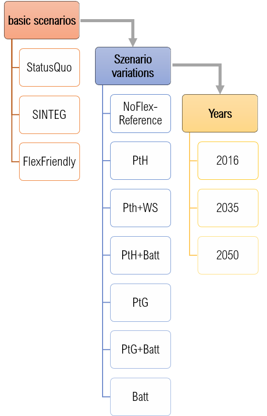
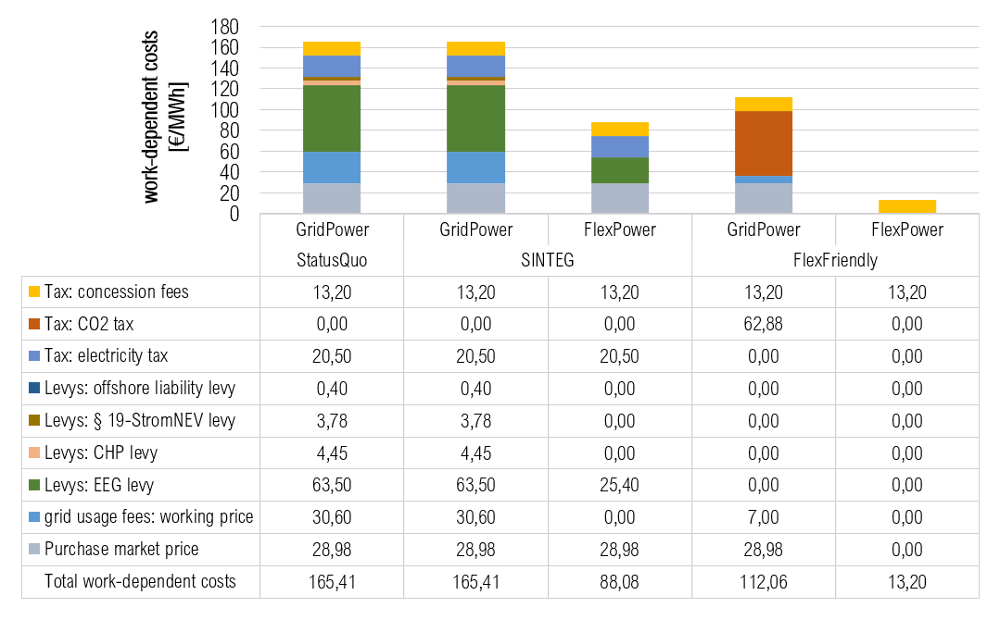
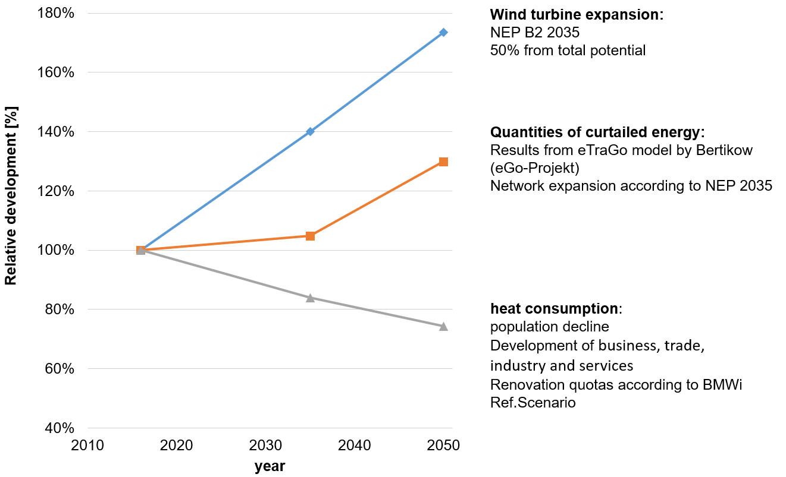
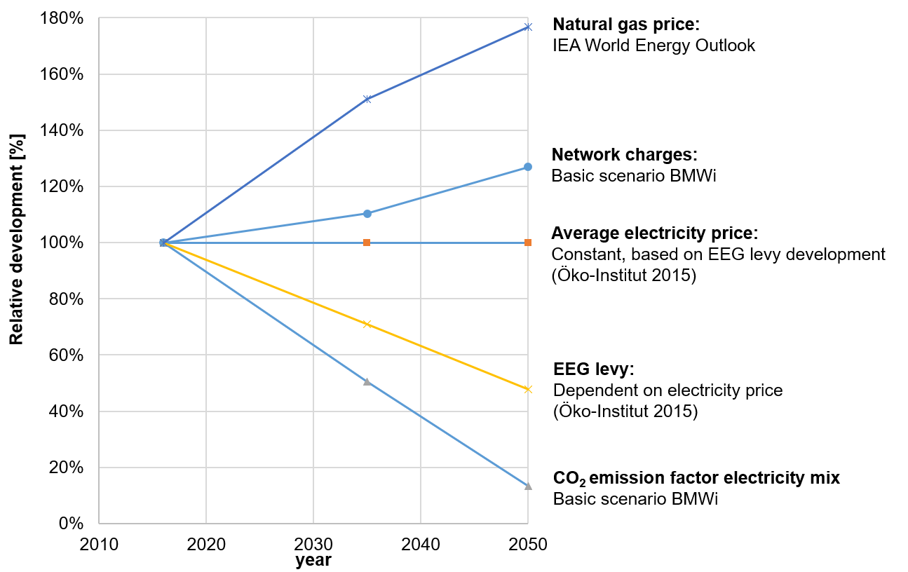

.. _scenarios:

Scenarios
=========
Variation of the regeluatory frame-work
--------------------------------------------

The three basic scenarios are divided into seven different scenario variations with regard to the flex options used. In the NoFlex variant, no FlexOpti-ns are implemented, which means that this variant primarily serves as a reference on the basis of which the influence of the FlexOptions application is evaluated.
In order to derive statements about possible future developments, all scenarios and scenario variations are examined for the years 2035 and 2050 in addition to the current status of 2016. These annual references are based on important transformation processes in electricity and heat supply [#]_ , as well as on milestones of the climate targets [#]_ . In the future, an increase in the supply of wind power is expected, including the amount of regulation, while the demand for heat will decrease due to the declining population and the increasing energy-efficient refurbishment. Furthermore, a rising gas price, rising NNE and a reduction of the EEG levy as well as different technology-specific development potentials are expected. The following figure shows the scenario structure once again schematically. This results in a total of 63 individual scenarios.

The status quo scenario represents the current regulatory framework.
In the SINTEG scenario, the distinction made in the SINTEG Regulation between grid and market electricity purchases and general electricity purchases is applied. In the KWUM model, this is illustrated by a differentiation between the unrestricted purchase of "grid electricity" and "FlexStrom", which depends on the EinsMan and the negative day-ahead market price.
In the parameterisation of the FlexFriendly scenario, the reform approaches with regard to the integration of capacity-related price components at the NNE and the introduction of cross-sector CO2 pricing were taken up. In this scenario, the price for the purchase of electricity from the grid consists only of the exchange price, the concession fees and the NNE. The working price of the NNE has fallen significantly as a result of an increase in the performance- and capacity-related price components. The largest cost factor for grid electricity procurement in 2016, at 56 %, is the cross-sector CO2 pricing. In the year 2050, however, due to the assumed strong reduction of the CO2 emission factor of the electricity mix, this only has a share of 22 %. Furthermore, it is assumed that Flex electricity can be purchased at no cost at EinsMan times due to its systemic nature, and at the current negative costs at times of negative exchange prices.

Variation of the used technologys
--------------------------------------------

As technical flexibility options, both storage and sector coupling technologies are examined in relation to the existing heat networks. The decentralised heat demand and the mobility sector are not the subject of this work. In the coupling of the electricity sector with the (central) heat sector, PtH in particular, especially in combination with a heat accumulator, has emerged as a rapidly accessible key technology for the substitution of fossil fuels [#]_ .
Another possibility for electrifying the heating sector in the medium term is attributed to PtG [#]_ . In combination with a subsequent methanation unit for the production of synthetic methane, the natural gas network can act as a gas storage facility and thus contribute to the flexibility of the PtG plant. This makes PtG one of the most suitable technologies for long-term storage [#]_ and is also the subject of this study.
In addition to the heating sector, the excess FlexStrom can also be used within electricity storage facilities. Pumped storage power plants, compressed air reservoirs and batteries, for example, are suitable for this purpose. While the geographical conditions for the construction of pumped storage power plants and compressed air reservoirs in the Uckermark are not favourable [#]_ , batteries can be installed flexibly and independently of location.
Batteries are currently still characterized by very high specific costs [#]_ , but very high cost degression is expected in the future, especially for lithium-ion batteries [#]_ and are also well suited to absorb the negative consequences of fluctuating feed-in of renewables in the low and medium voltage ranges [#]_ . Possible synergy effects in connection with the considered sector coupling technologies PtH and PtG are also analyzed. Particularly in the future, favourable battery options could increase the utilisation of very investment-intensive technologies such as PtG or reduce their electricity procurement costs and thus indirectly contribute to the electrification of the heating sector.

Assumptions for the development in the future
------------------------------------------------------------------

The following figures show the assumptions made in the model with regard to regional and supra-regional future developments.

Development of regional model parameters

Development of supra-regional model parameters

.. [#]  STERNER & STADLER 2017, S. 141 ff
.. [#]    BAUKNECHT u. a. 2016

.. [#]  AGORA ENERGIEWENDE 2017, S. 134; BECHEM u. a. 2015, S. 125; GERHARDT u. a. 2015, S. 106
.. [#]  KUPRAT 2017, S. 2; STERNER & STADLER 2017, S. 150
.. [#]  DEUTSCHER BUNDESTAG 2015, S. 16
.. [#]  MANN u. a. 2013, S. 124
.. [#]  WIETSCHEL, ULLRICH, MARKEWITZ & SCHULTE 2015, S. 208
.. [#]  KRZIKALLA, ACHNER & BRÜHL 2013, S. 67
.. [#]  AUNDRUP, BECK & BECKER 2015, S. 8

