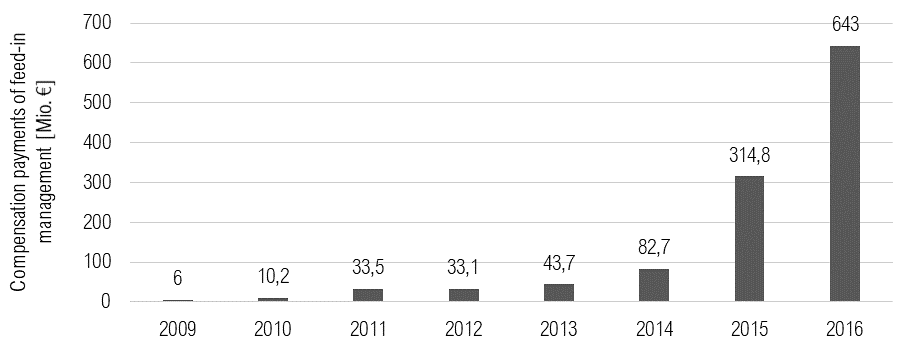
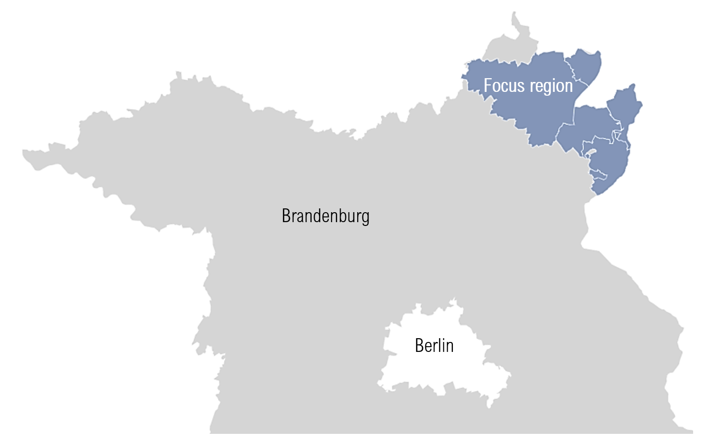

WindNODE_KWUM
=============

**Objective of the model**

In regions with high RES shares, the RES electricity that cannot be transported off the grid or used by local consumers is regulated by the feed-in scheme (EinsMan), whereby theoretically producible RES electricity is lost unused [#]_ . In addition, this unproduced "surplus" electricity is remunerated to the plant operators in the form of compensation payments. (see Figure 1.1). The resulting increase in the costs of the EinsMan is ultimately borne by the end consumer through higher grid usage fees (NNE) [#]_ . Finally, a decreasing acceptance of the energy system transformation within the population is to be expected due to the rising costs, which could endanger the achievement of the climate targets in the long term [#]_ .
In order to make better use of the existing capacities of the renewable energy plants, the "surplus" electricity could be stored temporarily on the one hand and used within other sectors (sector coupling) on the other [#]_ . However, it is above all the current regulatory framework with its system of taxes, network charges and allocations that prevents such use [#]_ .
Against the background of the further decarbonisation of the energy sector via renewables, it is therefore necessary to reduce the regulatory aspects that hinder flexibility and to create incentives that enable a cost-efficient, secure and comprehensive integration of renewables [#]_ . This paper therefore aims to analyse the deployment potential of different flex options under three different regulatory frameworks.

    Compensation payments caused by feed-in management measures in Germany

**WindNode Project**

In December 2016, the SINTEG funding programme was launched to undertake some of the challenges of the increasing share of electricity generated from renewable sources in the energy system. This programme is divided into five showcases regions; each of them has different goals and challenges. One of the five showcases is the WindNODE project, which takes place on the northeast of Germany, coincidentally with the area controlled by the transmission system operator 50Herzt (excluding Hamburg) [#]_.
The Reiner Lemoine Institute (RLI) is a partner of the joint research project WindNODE. The RLI participates in the analysis and comparison of two different regions: Uckermark and Anhalt. These research regions use different approaches for the integration of renewable energy, focusing on the use of flexibility options [#]_ . The research work of RLI in the Uck-ermark district is the analysis of business models of flexibility options; the estimation of the potential of the SINTEG-V regulation; and further possible regulations on the energy sec-tor [#]_.
One wind farm operator in the Uckermark district is ENERTRAG AG, who is also part of the WindNODE project. This enterprise has provided some data used in this research paper.

**Study Region in the Uckermark district**

The Uckermark is a mainly rural region in the northeast of Brandenburg on the border to Mecklenburg-Western Pomerania. The population density of 67.68 inhabitants per km² is well below the Brandenburg average of 84.91 [#]_ .
The focus region under consideration is located in the north-eastern part of the Uckermark and covers 1470 km², about half of the Uckermark [#]_ . The company Enertrag, the largest operator of wind turbines on site, provided the measurement data required for this investigation with regard to wind generation and control [#]_ . Since their plants extend over the postcode areas around 16303, 16306, 16307, 17291 and 17326, the focus region was defined on this basis (see Figure 2.1).

See :ref:`quickstart` for the first steps. A deeper guide is provided in :ref:`usage-details`.
We explain in detail how things are done in :ref:`features-in-detail`.
:ref:`data-sources` details on how to import and suitable available data sources.
For those of you who want to contribute see :ref:`dev-notes` and the
:ref:`api` reference.

LICENSE
-------

Copyright (C) 2018 Reiner Lemoine Institut gGmbH and Fraunhofer IEE

This program is free software: you can redistribute it and/or modify it under
the terms of the GNU Affero General Public License as published by the Free
Software Foundation, either version 3 of the License, or (at your option) any
later version.

This program is distributed in the hope that it will be useful, but WITHOUT
ANY WARRANTY; without even the implied warranty of MERCHANTABILITY or FITNESS
FOR A PARTICULAR PURPOSE. See the GNU Affero General Public License for more
details.

You should have received a copy of the GNU General Public License along with
this program. If not, see https://www.gnu.org/licenses/.

.. _oemof: https://oemof.readthedocs.io/en/stable/about_oemof.html

.. [#]  FATTLER, PICHLMAIER, ESTERMANN & OSTERMANN 2017, S. 59
.. [#]  FATTLER u. a. 2017, S. 57
.. [#]  KONDZIELLA u. a. 2019, S. 9
.. [#]  KONDZIELLA u. a. 2019, S. 11
.. [#]  SCHENUIT, HEUKE & PASCHKE 2016, S. 58; ZÖPHEL & MÜLLER 2016, S. 17
.. [#]  KONDZIELLA u. a. 2019, S. 34
.. [#]  BMWI 2019
.. [#]  RLI 2019
.. [#]  RLI 2019
.. [#]  FAKTOR-I3 GMBH 2013, S. 3
.. [#]  STATISTISCHE BUNDESAMT 2018
.. [#]  ENERTRAG 2018

